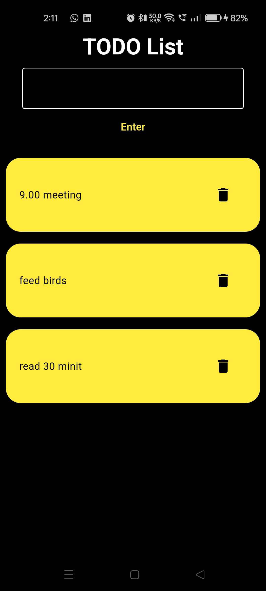
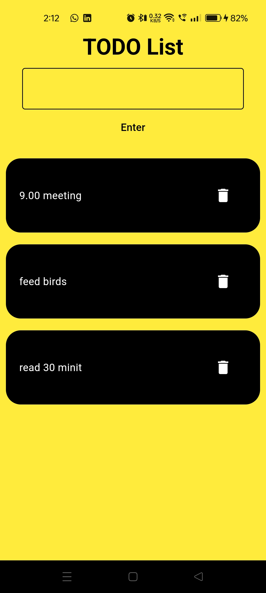

# TODO App

A clean and minimal Flutter application for managing daily tasks. Built using Dart and Flutter—ideal as a starter template or foundation to extend with features like persistent storage, notifications, or state management.

---

##  Project Status


---

## Table of Contents

- [Overview](#overview)  
- [Features](#features)  
- [Demo](#demo)  
- [Prerequisites](#prerequisites)  
- [Getting Started](#getting-started)  
- [Project Structure](#project-structure)  
- [Dependencies](#dependencies)  
- [Contributing](#contributing)  
- [License](#license)  

---

## Overview

A lightweight TODO application built with Flutter. Track, create, and manage tasks in a simple UI—perfect for learning Flutter or scaffolding enhanced task management features.

---

## Features

- Add, view, and delete tasks  
- Clean and intuitive UI  
_(Future enhancements suggested: persistent storage, reminders, task prioritization, theming)_

---

## Demo


## 🌓 Dark Mode vs Light Mode

Our TODO app supports both **Dark Mode** and **Light Mode** to suit your preference.

| Dark Mode | Light Mode |
|-----------|------------|
|  |  |


---

## Prerequisites

- **Flutter SDK** installed — ensure `flutter --version` works  
- A **simulator or physical device** (Android or iOS) for testing

---

## Getting Started

1. **Clone the project:**
   ```bash
   git clone https://github.com/jeryjohn/todo_app.git
   cd todo_app
1. **Clone the project:**
   ```bash
   git clone https://github.com/jeryjohn/todo_app.git
   cd todo_app
